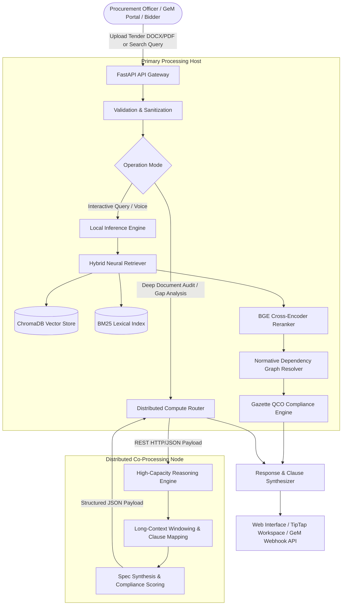
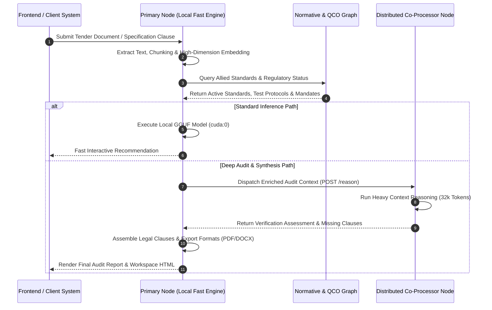

# BIS-SpecAI: Distributed Hybrid-Intelligence Engine for Indian Standards (BIS) & e-Procurement Governance

[](https://fastapi.tiangolo.com)
[](https://pytorch.org)
[](https://www.trychroma.com/)
[](https://react.dev)
[](#)

---

## Executive Summary

**BIS-SpecAI** is an enterprise-grade, distributed AI recommendation, audit, and specification-authoring platform engineered for modern public and private e-Procurement ecosystems (GeM, CPPP, State/PSU Tender Portals). 

The platform resolves procurement ambiguities, regulatory non-compliance, and obsolete engineering standards by harmonizing **hybrid neural retrieval (Dense + Sparse Reciprocal Rank Fusion)**, **multi-relational normative graph traversal**, **statutory Quality Control Order (QCO) enforcement**, and a **heterogeneous distributed inference topology**.

```
+--------------------------------------------------------------------------------------------------+
|                                  DISTRIBUTED TOPOLOGY OVERVIEW                                   |
|                                                                                                  |
|   +---------------------------------------+             +------------------------------------+   |
|   |         Primary Processing Node       |             |     High-Throughput Reasoning      |   |
|   |       (Workstation / Edge Host)       |             |         Accelerator Node           |   |
|   |                                       |             |                                    |   |
|   |   * FastAPI Application Gateway       |   REST/SSE  |   * Deep Context Reasoning Engine  |   |
|   |   * CUDA Tensor Embeddings & Rerank   | <=========> |   * Extended Context Window (32k)  |   |
|   |   * Reciprocal Rank Fusion (RRF)      |             |   * Complex Tender Audit Synthesis |   |
|   |   * Low-Latency Fast Inference (3B)   |             |   * Epistemic Constraint Validation|   |
|   +---------------------------------------+             +------------------------------------+   |
|                       |                                                                          |
|                       v                                                                          |
|   +---------------------------------------+                                                      |
|   |    ChromaDB Neural Knowledge Store    |                                                      |
|   |    Normative Dependency Graphs        |                                                      |
|   |    Gazette QCO Regulatory Registry    |                                                      |
|   +---------------------------------------+                                                      |
+--------------------------------------------------------------------------------------------------+
```

---

## Core Technical Capabilities

### 1. Hybrid Semantic Standard Retrieval & RRF
* **Dense Semantic Representation**: Bi-encoder vector representations leveraging multilingual sentence transformers (`paraphrase-multilingual-MiniLM-L12-v2`).
* **Sparse Lexical Ranking**: BM25 vocabulary scoring over normalized technical taxonomies, standard designations, and titles.
* **Reciprocal Rank Fusion (RRF)**: Combines dense contextual projections and sparse token matches with cross-encoder re-ranking (`bge-reranker-small`).

### 2. Normative Knowledge Graph Resolution
Traverses multidirectional dependency graphs across:
* **Primary Product Standards** (e.g., `IS 1786` for High Strength Deformed Steel Bars)
* **Normative Testing Protocols** (Tensile, bend, chemical composition, charpy impact)
* **Statutory Safety Codes & Codes of Practice** (e.g., `IS 456` for Plain and Reinforced Concrete)
* **Deprecation & Reaffirmation Cascades** (Auto-detecting superseded years and mapping to current reaffirmed revisions).

### 3. Statutory Quality Control Order (QCO) Engine
* Validates tenders against Gazette notifications issued by DPIIT, MeitY, Ministry of Steel, Ministry of Power, and Ministry of Textiles.
* Automatically discriminates between mandatory **ISI Mark (Scheme I)** and **CRS Registration (Scheme II)** protocols.
* Emits real-time compliance deficit alerts and calculation of QCO coverage index.

### 4. Distributed Multi-Node Compute Infrastructure
* Decouples prompt preprocessing, vector search, and fast interactive response synthesis from intensive multi-thousand-token document audit workflows.
* Operates an asymmetric compute fabric: localized CUDA hardware executes rapid low-latency tasks, while remote distributed worker nodes process heavy reasoning passes over large tender corpora.

### 5. Multilingual Indic Query Processing
* Native linguistic token normalization and semantic alignment for Hindi, Tamil, Telugu, and Bengali technical terminologies directly mapped to standard Indian technical lexicons.

---

## System Architecture & Information Flow

### End-to-End Execution Flow



### Distributed Reasoning Sequence



---

## Hardware & Environment Prerequisites

### 1. Primary Processing Host
* **Operating System**: Windows 10/11 x64 or Enterprise Linux (Ubuntu 22.04+)
* **GPU**: Dedicated NVIDIA GPU with minimum 6 GB VRAM (RTX 3050 or higher recommended)
* **CUDA Toolkit**: 12.1+ / cuDNN 8.9+
* **System Memory**: 16 GB RAM minimum
* **Storage**: Fast NVMe SSD storage (recommended on dedicated partitions or drives, e.g., `D:\`)

### 2. Distributed Compute Accelerator Node
* **Network Connectivity**: Low-latency LAN / Gigabit Ethernet connection between nodes
* **Memory Architecture**: High unified or system memory (minimum 16 GB - 32 GB) to support 32,768-token context windows.
* **Service Binding**: Host service listening on network interface (e.g., `http://<NODE_IP>:5008/reason`).

---

## Models & Weights Acquisition Guide

All required open-weight models must be placed in the designated `llm/` directory as specified in `backend/config/config.yaml`.

| Model Component | Architecture / Format | Function | Target Directory / Filename | Source Link |
|---|---|---|---|---|
| **Primary Local LLM** | `Qwen2.5-3B-Instruct` (GGUF Q4_K_M) | Low-latency parsing & preprocessing | `llm/Qwen2.5-3B-Instruct-Q4_K_M.gguf` | [HuggingFace Hub](https://huggingface.co/Qwen/Qwen2.5-3B-Instruct-GGUF) |
| **High-Precision Local LLM** | `Qwen2.5-7B-Instruct` (GGUF Q4_K_M) | Local tender clause extraction & grounding | `llm/Qwen2.5-7B-Instruct-Q4_K_M.gguf` | [HuggingFace Hub](https://huggingface.co/Qwen/Qwen2.5-7B-Instruct-GGUF) |
| **Multilingual Embedding Model** | `paraphrase-multilingual-MiniLM-L12-v2` | Dense vector index generation & semantic search | `llm/paraphrase-multilingual-MiniLM-L12-v2` | [HuggingFace Hub](https://huggingface.co/sentence-transformers/paraphrase-multilingual-MiniLM-L12-v2) |
| **Cross-Encoder Reranker** | `bge-reranker-small` | Candidate pool re-ranking | `llm/bge-reranker-small` | [HuggingFace Hub](https://huggingface.co/BAAI/bge-reranker-small) |
| **Speech-to-Text (STT)** | `faster-whisper-tiny` | Voice query ingestion | `llm/faster-whisper-tiny` | [Systran Faster-Whisper](https://huggingface.co/Systran/faster-whisper-tiny) |
| **Text-to-Speech (TTS)** | `mms-tts-eng` / `mms-tts-hin` | Multilingual vocal response | `llm/mms-tts-eng`, `llm/mms-tts-hin` | [Facebook MMS](https://huggingface.co/facebook/mms-tts) |

### Automated Fast-Model Ingestion

To acquire the default local quantized model via command line:

```powershell
# Using the automated Windows batch utility
.\download_qwen25_3b.bat

# Or manual download via curl
curl.exe -L --progress-bar -o "llm/Qwen2.5-3B-Instruct-Q4_K_M.gguf" ^
  "https://huggingface.co/Qwen/Qwen2.5-3B-Instruct-GGUF/resolve/main/qwen2.5-3b-instruct-q4_k_m.gguf"
```

---

## Installation & Deployment

### Step 1: Clone Repository
```bash
git clone https://github.com/Naseer-fez/Hackathon.git
cd Hackathon
```

### Step 2: Environment & Dependencies

Configure a Python 3.10+ virtual environment:

```powershell
python -m venv venv
.\venv\Scripts\Activate.ps1
```

Install core dependencies and CUDA-accelerated PyTorch:
```powershell
pip install --upgrade pip
pip install torch torchvision --index-url https://download.pytorch.org/whl/cu121
pip install -r requirements.txt
```

For GPU-accelerated GGUF execution on Windows:
```powershell
pip install llama-cpp-python --extra-index-url https://abetlen.github.io/llama-cpp-python/whl/cu124
```

### Step 3: Distributed Configuration Setup

Update `backend/config/config.yaml` or set environment variables:

```yaml
distributed_reasoning:
  mac_available: true
  mac_endpoint: "http://<DISTRIBUTED_NODE_IP>:5008/reason"
  local_preprocessor_model: "llm/Qwen2.5-3B-Instruct-Q4_K_M.gguf"
  fast_model_n_ctx: 4096
  thinking_model_n_ctx: 32768
  fast_model_n_gpu_layers: 36
  mac_timeout_sec: 25.0
```

### Step 4: Launch Backend & Frontend Services

```powershell
# Terminal 1: Launch Backend Engine
python -m uvicorn backend.main:app --host 0.0.0.0 --port 8000 --reload

# Terminal 2: Launch Web Presentation Layer
cd frontend
npm install
npm run dev
```

The Web Interface will be available at `http://localhost:5173` and the OpenAPI Explorer at `http://localhost:8000/docs`.

---

## Production API Endpoints Reference

| Protocol | Route | Method | Purpose |
|---|---|---|---|
| `REST` | `/api/v1/recommend` | `POST` | Semantic query recommendation with normative dependencies and QCO tagging. |
| `REST` | `/api/v1/analyze-tender` | `POST` | Multi-format (PDF/DOCX/TXT) tender compliance gap audit. |
| `REST` | `/api/v1/workspaces` | `POST` | State-managed procurement revision workspace generator. |
| `SSE`  | `/api/v1/workspaces/{id}/chat-stream` | `POST` | Grounded interactive procurement streaming assistant. |
| `REST` | `/api/v1/workspaces/{id}/export` | `POST` | Approval-gated tender specification document compilation (DOCX/PDF). |
| `REST` | `/api/v1/gem-webhook` | `POST` | Real-time GeM portal pre-bid validation webhook simulator. |
| `REST` | `/api/v1/standards/{is_code}` | `GET` | Complete metadata, amendments, and normative dependency tree. |
| `REST` | `/api/v1/health` | `GET` | System health check, VRAM allocation, and cluster connectivity. |

---

## Governance & Verification

All standard citations, amendments, and Quality Control Orders conform to Gazette orders authorized by the **Bureau of Indian Standards (BIS)** and administrative ministries of the Government of India. The engine strictly avoids domain hallucination by enforcing epistemic constraints and multi-hop graph validation.
